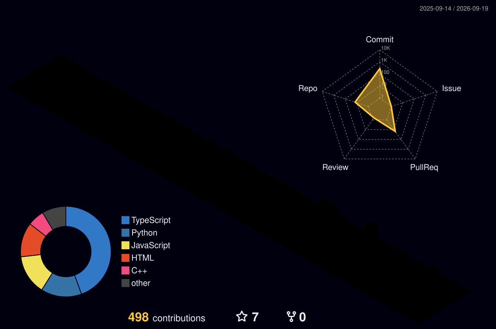

<div align="center">
<picture>
  <source media="(prefers-color-scheme: dark)" srcset="https://github.com/zynx095.png">
  <source media="(prefers-color-scheme: light)" srcset="https://github.com/zynx095.png">
  
</picture>

<br>


<a href="https://yukithjoseph.me"></a>
<a href="https://linkedin.com/in/yukith-joseph"></a>
<a href="mailto:yukithj@gmail.com"></a>

</div>

<br>

<!-- QUICK STATS ROW — mirrors the "Contributions / Streak" card in the screenshot -->
<div align="center">


</div>

---

## `> whoami`

```text
Yukith Joseph
Computer Science & Engineering — Networks

AI Systems        ████████████████████░░
Cybersecurity     ██████████████████░░░░
Networks          █████████████████░░░░░
Embedded Systems  ███████████████░░░░░░░
Computer Vision   ████████████████░░░░░░
```

I build systems at the intersection of **AI, cybersecurity, networks, embedded hardware, and intelligent automation**.

My projects range from local AI assistants and computer-vision systems to network intrusion detection, encrypted-traffic analysis, DLP concepts, robotics, and edge computing.

`IDEA → ARCHITECTURE → CODE → HARDWARE → INTERFACE → TESTING`

---

## `// COMMUNITY SIGNAL`

<table>
<tr>
<td width="42%" valign="top">

**Featured repositories** · public GitHub profile

| Repo | Focus | Stars |
|---|---|---|
| [`AURA`](https://github.com/zynx095/AURA) | Computer vision / AI | ★ |
| [`shadowguard`](https://github.com/zynx095/shadowguard) | Cybersecurity / DLP | ★ |
| [`SUGAR-AI`](https://github.com/zynx095/SUGAR-AI) | Offline AI assistant | ★ |

<br>


</td>
<td width="58%" valign="top">


</td>
</tr>
</table>

---

## `// TECH STACK`

<p align="center">
  <picture>
    <source media="(prefers-color-scheme: dark)" srcset="https://www.gitskins.com/api/section/stack?username=zynx095&theme=github-dark">
    <source media="(prefers-color-scheme: light)" srcset="https://www.gitskins.com/api/section/stack?username=zynx095&theme=github-dark&mode=light">
    
  </picture>
</p>

<div align="center">

`Python` · `TypeScript` · `JavaScript` · `C++` · `Java` · `SQL`

`PyTorch` · `TensorFlow` · `Scikit-Learn` · `YOLO` · `OpenCV`

`FastAPI` · `React` · `Next.js` · `Node.js` · `Tailwind`

`Ollama` · `Whisper` · `LangChain` · `Arduino` · `ESP32`

`Git` · `GitHub` · `Docker` · `Linux` · `OpenSCAD` · `Unity`

</div>

---

## `// PROJECTS`

<table>
<tr>
<td width="50%">

### AURA
**Autonomous Unified Recognition Assistant**
Computer-vision surveillance and situational-awareness platform combining object detection, tracking, analytics, and real-time system interaction.
`Next.js` `FastAPI` `Python` `YOLO` `OpenCV`
<a href="https://github.com/zynx095/AURA">VIEW REPOSITORY →</a>

</td>
<td width="50%">

### SHADOWGUARD
**AI Security & Data Protection**
Cybersecurity system focused on detecting and preventing unauthorized data movement toward external AI systems and sensitive services.
`Python` `DLP` `Threat Detection` `Security`
<a href="https://github.com/zynx095/shadowguard">VIEW REPOSITORY →</a>

</td>
</tr>
<tr>
<td width="50%">

### SUGAR-AI
**Offline AI Desktop Assistant**
Local-first voice assistant using local LLM inference, speech recognition, TTS, memory, and modular AI components.
`Python` `Ollama` `Whisper` `MeloTTS`
<a href="https://github.com/zynx095/SUGAR-AI">VIEW REPOSITORY →</a>

</td>
<td width="50%">

### ENCRYPTED TRAFFIC THREAT HUNTER
**Encrypted Network Traffic Research**
Research pipeline exploring TLS fingerprints and encrypted-flow behavior for threat detection without decrypting network payloads.
`Python` `PCAP` `JA3` `JA4` `Scapy`
<a href="https://github.com/zynx095/encrypted-traffic-threat-hunter">VIEW REPOSITORY →</a>

</td>
</tr>
</table>

| System | Domain | Status |
|---|---|---|
| AURA | Computer Vision / AI | Active |
| ShadowGuard | Cybersecurity / DLP | Active |
| SUGAR-AI | Local AI / Voice | Active |
| Encrypted Traffic Threat Hunter | Network Security / Research | Research |
| NIDS | Network Security / ML | Active |
| STP Cleaning Robot | Robotics / Edge AI | Prototyped |
| AUTOHIRE | AI / Recruitment | Prototyped |
| Smart Waste Management | Embedded / IoT | Built |
| Food Waste Tracking System | Full Stack | Built |

---

## `// CONTRIBUTION ACTIVITY`

<div align="center">


<br><br>



</div>

> Both animations above read from **your own account token**, not a public API — that's the only way GitHub lets private squares show up in a README. Add this one workflow to `zynx095/zynx095` and everything on this page (streak card, activity graph, snake, 3D calendar) starts including private contributions by default.

<details>
<summary><strong>⚙️ .github/workflows/contribution-visuals.yml (click to expand)</strong></summary>

```yaml
name: Contribution Visuals

on:
  schedule:
    - cron: "0 */6 * * *"
  workflow_dispatch: {}
  push:
    branches: [ "main" ]

jobs:
  snake:
    permissions:
      contents: write
    runs-on: ubuntu-latest
    steps:
      - uses: Platane/snk@v3
        with:
          github_user_name: zynx095
          outputs: |
            dist/github-contribution-grid-snake.svg
            dist/github-contribution-grid-snake-dark.svg?palette=github-dark
      - uses: crazy-max/ghaction-github-pages@v4
        with:
          target_branch: output
          build_dir: dist
        env:
          GITHUB_TOKEN: ${{ secrets.GITHUB_TOKEN }}

  grid3d:
    permissions:
      contents: write
    runs-on: ubuntu-latest
    steps:
      - uses: yoshi389111/github-profile-3d-contrib@0.7.1
        env:
          GITHUB_TOKEN: ${{ secrets.GITHUB_TOKEN }}
        with:
          username: zynx095
      - uses: crazy-max/ghaction-github-pages@v4
        with:
          target_branch: output
          build_dir: profile-3d-contrib
        env:
          GITHUB_TOKEN: ${{ secrets.GITHUB_TOKEN }}
```

Requirements: this workflow must live in the repo named exactly `zynx095/zynx095` (GitHub's special profile repo), and **Settings → Profile → Contributions → "Include private contributions"** must be turned on for the private squares to count at all — GitHub withholds that data from every third-party badge/embed otherwise, no exceptions.

</details>

---

<div align="center">


</div>

---

## `// CONNECT`

<div align="center">

<a href="https://yukithjoseph.me"></a>
<a href="https://linkedin.com/in/yukith-joseph"></a>
<a href="mailto:yukithj@gmail.com"></a>

<br><br>


<br><br>

```text
AI  ·  SECURITY  ·  NETWORKS  ·  EMBEDDED

BUILDING SYSTEMS THAT THINK.
```

</div>
